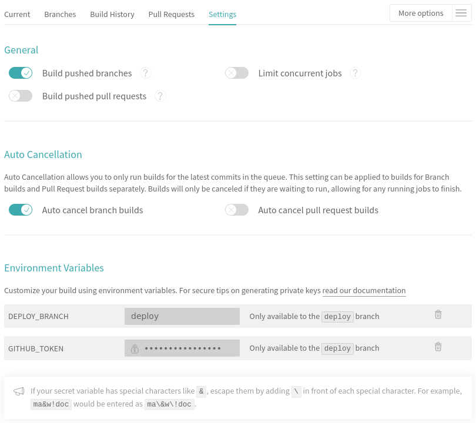

# AUR Deploy

Create your personal [Arch Linux] [AUR] packages repository, deploying
via [Travis CI] to [GitHub Releases] or other providers.

## Installation

- Fork this repository
- Create a new branch, e.g.: `git checkout -b deploy` (*)
- [Enable Travis CI] on it
- Edit the config files
- Generate a [personal access token] with scope `public_repo`

On [Travis CI] repository settings:

- Turn off `Build pushed pull requests`
- Optionally turn on `Auto cancel branch builds`
- Add a `GITHUB_TOKEN` environment variable with the personal access token code
  as value and set it as hidden
- Add a `DEPLOY_BRANCH` environment variable
  with the name of your `deploy` branch as value. (*)
- Optionally, create a cron job

(*) These two simple steps was added to let the `master` branch to remain
    clean to permit possible future contributions if you'll need to propose
    a new feature.

## Use repository

For user-specific instructions use the ones generated from the branch `gh-pages`
on your fork, which should be already available at
`https://accountname.github.io/aur`, or check [here] for generic ones.

[Arch Linux]:      https://www.archlinux.org/
[AUR]:             https://aur.archlinux.org/
[Travis CI]:       https://travis-ci.com/
[GitHub Releases]: https://github.com/archlive/aurdeploy/releases
[here]:            https://archlive.github.io/aurdeploy/

[Enable Travis CI]:      https://github.com/settings/installations
[personal access token]: https://github.com/settings/tokens/new
